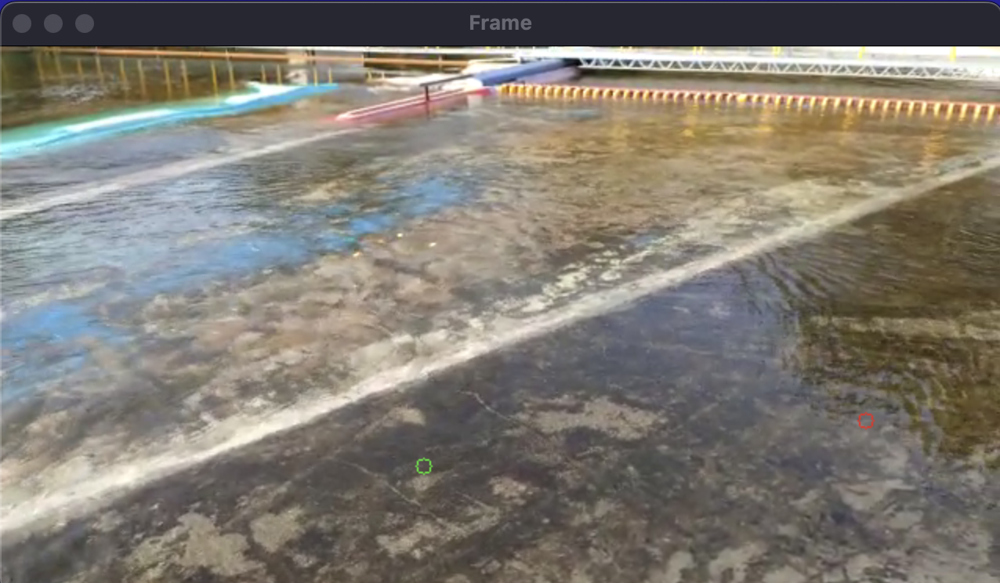
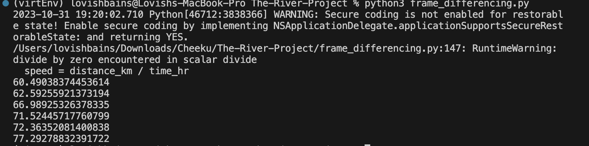

# The Tawi River Project
## Detecting the speed of Tawi River using Image processing 
<!DOCTYPE html>
<html>
<body>

<p>This project was undertaken to utilize image processing techniques for the purpose of determining the speed of the Tawi River.</p>
<p>
<h3>Algorithm Used to calculate flow speed:</h3>
Optical Flow: Optical flow is the pattern of apparent motion of image objects between two consecutive frames caused by the movement of the object or camera. It is a 2D vector field where each vector is a displacement vector showing the movement of points from the first frame to the second. Optical flow works on several assumptions: The pixel intensities of an object do not change between consecutive frames. Neighboring pixels have similar motions.
</p>

### Usage
Clone the project using the following command:
```
git clone repo_url
```

After cloning the project, run the following command"
```
pip install -r requirements.txt
```
It will install all the necessary dependencies required for running the project.

Then, run:
```
python3 frame_differencing.py
```

Red circle symbolizes the point of interest(POI, tracked point) in the previous frame whereas Green circle symbolizes the POI in the current frame and avg_speed is calculated by taking average of predefined numbers of frames as per the requirement.

\](<Screen Recording 2023-10-31 at 7.38.09 PM.gif>)](video.gif)

The video under usage is `river2.mp4` and the determined speed in (km/hr) is being printed in the terminal.
 

